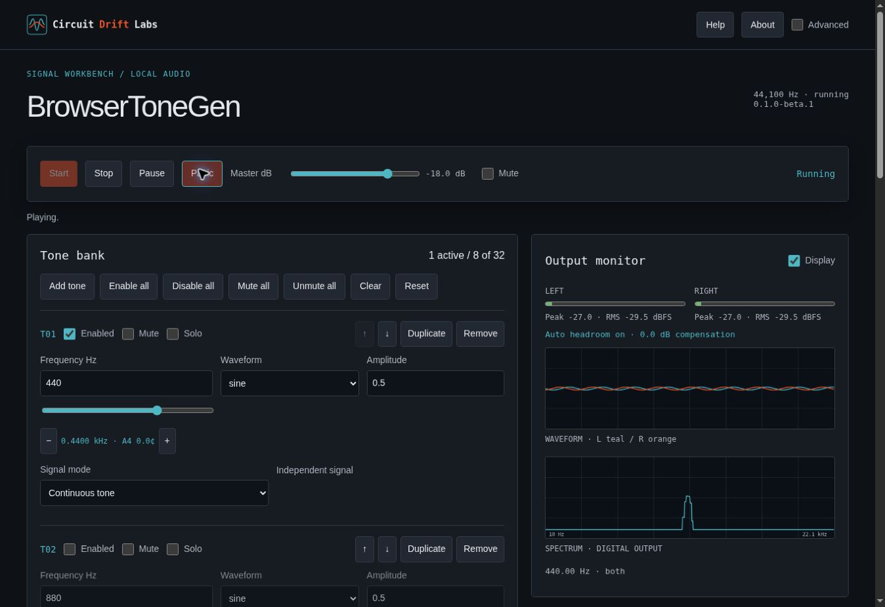

# BrowserToneGen

A browser multi-tone signal workbench by [Circuit Drift Labs](https://djshellshoxxx.github.io/circuitdriftlabs/). Version **0.2.0-beta.1**.

Live app: https://djshellshoxxx.github.io/browsertonegen/. Deployed and verified. See [final audit](docs/FINAL_AUDIT.md) for test evidence and limits.



## Use

Open the app, choose a reference preset or enable/edit a tone, then press Start. The default bank has eight slots; up to 32 voices can run simultaneously. Enable Advanced for phase/routing/timing, harmonics, modulation, sequences, stereo tools and sequences. Automation, MIDI and audio saving are available in simple mode. Stop fades the output; Escape/Panic silences it immediately. Space controls transport outside focused controls.

## New in 0.2

Live-added matching tones inherit oscillator phase to prevent accidental cancellation. Newly added or re-enabled voices start their own timing schedule. Add per-tone automation lanes for pitch, amplitude, pan, phase, pulse width, modulation rate or depth; use linear/exponential ramps and sine/triangle cycles. Connect MIDI controllers with channel-specific CC mappings and MIDI Learn. Presets/JSON/share links preserve automation and mappings. Save audio through offline WAV rendering or record live output to capture manual/MIDI changes.

Use the on-page Automation recipes panel or [sound recipes](docs/AUTOMATION_RECIPES.md) for bass drops, sweeps, sub tests, sub drops and wobbles.

## Features

* Sine, square, triangle, saw, reverse saw, adjustable pulse, additive harmonics and five noise colors.
* Independent frequency, amplitude/dB, phase, polarity, pan, channel, mute/solo and envelopes.
* Linear/log sweeps, steps, ping-pong/repeat/loop, shared signal sequences and global timer.
* Harmonic/subharmonic/chord/interval/temperament/detune/cluster and binaural/monaural groups.
* AM/FM/tremolo/vibrato/ring modulation, channel alternation and pan sweeps.
* Stereo scope, FFT spectrum, peak/RMS meters, visible automatic headroom and digital ceiling indicator.
* Local presets, JSON import/export, share URLs, musical/frequency calculator and optional troubleshooting logs.
* Worker WAV export: mono/stereo, 44.1/48/96 kHz, PCM 16/24-bit or float32, normalization and cancellation.

## Interface

The sticky transport sits above a tone bank and output monitor. Simple mode keeps reference generation close at hand. Expand the instrument panels in Advanced to access per-tone settings and the stage editor. No sound starts on page load, import or URL restore. All processing stays in your browser; there is no account, microphone access, tracking or upload.

## Local development

No application dependencies or build step. Node 24 runs core tests; Python only serves static files.

```sh
npm test
python -m http.server 8000
```

Open http://localhost:8000. To test the production subpath, serve this directory's parent and open http://localhost:8000/browsertonegen/.

Browser automation (development only):

```sh
npm install --no-save playwright@1.62.1
npx playwright install chromium --only-shell
BTG_TEST_URL=http://localhost:8000/ npm run test:browser
```

Use `?debug=1` or Advanced → Diagnostics → Troubleshooting logs. Copy diagnostics or download JSON. Logs are bounded to 300 entries and remain local.

## Architecture

Static HTML/CSS and ES modules. One persistent AudioContext runs one stereo AudioWorklet; a GainNode controls stop/panic, and two AnalyserNodes inspect channels. The worklet and export Worker use the same DSP module. Validation reconstructs a bounded versioned state. Node tests measure generated samples directly. See [architecture](docs/ARCHITECTURE.md), [development](docs/DEVELOPMENT.md) and [testing](docs/TESTING.md).

## Deployment

`.github/workflows/pages.yml` runs Node tests and the Playwright browser suite before uploading a static Pages artifact. Set repository **Settings → Pages → Source → GitHub Actions**. The connected repository tools may not expose that administrative setting; if deployment is blocked, the audit records it. All asset/worklet/worker URLs are relative to support `/browsertonegen/`.

## Compatibility and limits

Requires a modern browser with ES modules, Web Audio and AudioWorklet over HTTPS or localhost. WAV rendering requires module Workers. 38 core tests and 16 Chromium browser interaction groups pass; Firefox, Safari/iOS and physical audio output require verification as indicated in the audit. Background tabs and mobile OS policies may interrupt playback. Audio hardware/output volume is outside the app.

Frequency range is 0.1 Hz to actual sample-rate Nyquist minus 1 Hz. Digital levels are peak-scale dBFS, not calibrated SPL or volts. Noise colors and anti-aliasing are approximations. Modulation can create aliasing. The final 0.98 hard ceiling is reported and may distort overloaded signals. No microphone/room-response measurement, grey-noise calibration, speech announcements or PWA caching in this beta. Export maximum 120 s; longest 96 kHz stereo renders can use about 185 MB.

[User guide](docs/USER_GUIDE.md) · [Research](research/RESEARCH.md) · [Specifications](spec/PROJECT_SPEC.md) · [Requirements matrix](spec/REQUIREMENTS_MATRIX.md)
